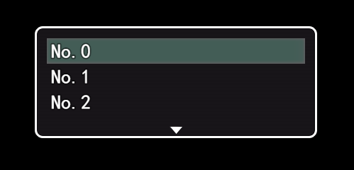
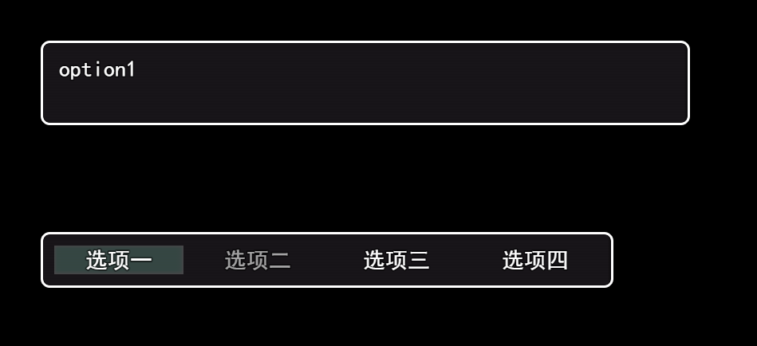
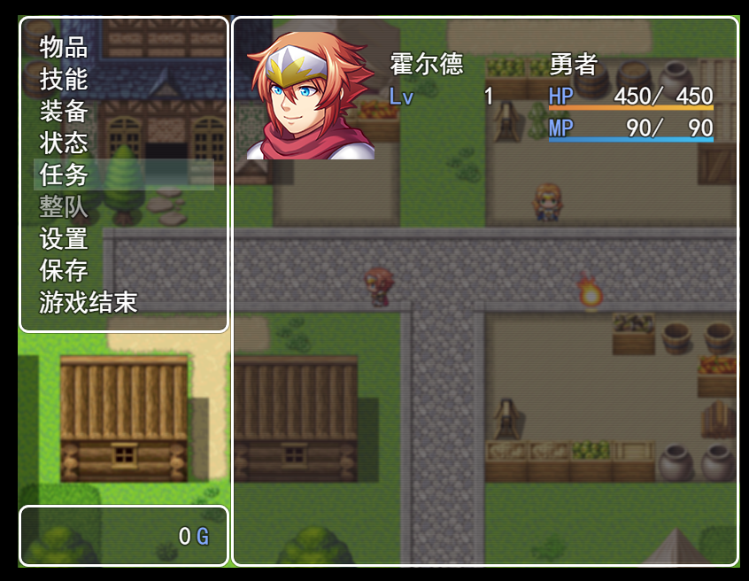

# 窗口类 #

js文件夹下rpg_windows.js为游戏窗口类文件，包括游戏中各种数据显示的外部框架。如对话框，商店界面，人物状态技能等界面展示数据都是由窗口类完成的。而窗口类显示依赖于场景，所以必须在场景中添加窗口才能使其出现在对应场景的位置。

### <a href="#p1"> Window_Base 类</a> ###

### <a href="#p2">Window_Selectable 类</a> ###

### <a href="#p3"> Window_Command 类</a> ###

### <a href="#p4"> Window_HorzCommand 类</a> ###

### <a href="#p5"> Window_Help 类</a> ###

### <a href="#p6"> Window_Gold 类</a> ###

###  <a href="#p7"> Window_MenuCommand 类</a>   ###

###  <a href="#p8">  Window_MenuStatus 类</a>   ###

###  <a href="#p9">  Window_MenuActor 类</a>   ###

### <a href="#p10"> Window_ItemCategory 类</a> ###

### <a href="#p11"> Window_ItemList 类</a> ###

### <a href="#p12"> Window_SkillType 类</a> ###

### <a href="#p13"> Window_SkillStatus 类</a> ###

### <a href="#p14"> Window_SkillList 类</a> ###

### <a href="#p15"> Window_EquipStatus 类</a> ###

### <a href="#p16"> Window_EquipCommand 类</a> ###

### <a href="#p17">  Window_EquipSlot 类</a> ###

### <a href="#p18">  Window_EquipItem 类</a> ###

### <a href="#p19">  Window_Status 类</a> ###

### <a href="#p20">  Window_Options 类</a> ###

### <a href="#p21">  Window_SavefileList 类</a> ###

### <a href="#p22">  Window_ShopCommand 类</a> ###

### <a href="#p23"> Window_ShopBuy 类</a> ###

### <a href="#p24"> Window_ShopSell 类</a> ###

### <a href="#p25"> Window_ShopNumber 类</a> ###

### <a href="#p26"> Window_ShopStatus 类</a> ###

### <a href="#p27">  Window_NameEdit 类</a> ###

### <a href="#p28">  Window_NameInput类</a> ###

### <a href="#p29">  Window_Message类</a> ###

### <a href="#p30">  Window_ChoiceList类</a> ###

### <a href="#p31">  Window_NumberInput类</a> ###

***
<p id="p1"></p>

##  Window_Base ##  

所有窗口类均继承Window_Base，该类属性方法如下:

Window_Base._iconWidth  = 32 : 窗口内部图标显示宽度

Window_Base._iconHeight = 32 : 窗口内部图标显示高度

Window_Base._faceWidth  = 144 : 窗口内部脸图显示宽度

Window_Base._faceHeight = 144 : 窗口内部脸图显示高度

**standardFontFace()** : 返回标准字体

**standardFontSize()** : 返回标准字体大小（默认28）

**standardPadding()** : 返回字体到边框内间距（默认18）

**textPadding()** : 返回字内间距（默认6)

**standardBackOpacity** : 返回标准字体透明度（默认192）

**loadWindowskin()** : 加载窗口创建使用的图集

**updatePadding()** : 每帧更新的间距

**updateBackOpacity()** : 每帧更新的透明度

**contentsWidth()** : 返回窗口主体内容的宽度（即窗口宽度减去内间距）

**contentsHeight()** : 返回窗口主体内容的高度

**fittingHeight(n)** : 返回合适的窗口高度（不改变窗口大小）
* [n:Number] 文本的行数

**updateTone()** : 更新窗口色调

**createContents()** : 创建窗口主体块

**resetFontSettings()** :重置字体标准化设置（颜色，大小）

**resetTextColor()** : 重置字体颜色

**update()** : 每帧执行函数

**updateOpen(),isOpening(),open()** : 窗口打开状态

**updateClose(),isClosing(),close()** :  窗口关闭状态

**show()** : 显示窗口并返回true

**hide()** : 隐藏窗口并返回false

**activate()** : 窗口活动状态标志置为true

**deactivate()** :  窗口活动状态标志置为false

**textColor(n)** : 返回n对应的16进制颜色类型。<br>[n:Number]: 颜色序号数。所能匹配的颜色参考/img/system/Window.png右下角的颜色块从0开始到31结束。

**xxxColor()** :返回xxx所代表的颜色序号数

**translucentOpacity()** :返回半透明值（160）

**changeTextColor(c)** : 改变字体颜色,在描绘字体之前调用才有效！

* [c:String] : 颜色描绘字符（#ff0000,red,gba(255,0,0)）

**changePaintOpacity(c)** : 改变字体透明度<br>[c:Any] 有值为不透明，无值为半透明

**drawText(text, x, y, maxWidth, align)** : 在窗口指定区域绘制文本
* [text:String] : 绘制文本<br>
* [x:Number] : 绘制文本起点x坐标值<br>
* [y:Number] : 绘制文本起点y坐标值<br>
* [maxWidth:Number] : 绘制文本的最大宽度，如果不给出则适应长度，给出如果超出字体所占宽度则会缩放字体<br>
* [align:String] : 文本对齐方式（left,center,right）

**textWidth(text)** : 返回文本所占宽度<br>[text:String] :所要得到文本宽度的文本

**drawTextEx(text)** :绘制可以含有游戏变量数据以及图标的文本
* [text:String] : 绘制文本，如下所示<br>


* [x:Number] : 绘制文本起点x坐标值<br>
* [y:Number] : 绘制文本起点y坐标值<br>

注意的是在游戏编辑器中输入一个`\`即可转移。而在js脚本中需要输入两个`\\`来达到转移效果如
`"HelloWorld \\i[1]";`

**convertEscapeCharacters(text)** : 匹配上图的控制字符text。上个方法所调用的转义方法

**actorName(n)** : 返回角色名

* [n:Number] : 角色列表第n行的对应的角色名

**partyMemberName(n)** : 返回队伍第n个人的名字

* [n:Number] : 队伍排序第n个人

**processCharacter(textState)** : 逐个字符渲染函数

[textState:Object] : `{index: 1, x: 14, y: 0, left: 0, text: 'HelloWorld'}`

**processNormalCharacter(textState)** : 普通渲染函数过程无转义

**processNewLine(textState)** : 新行渲染函数过程

**processDrawIcon(iconIndex, textState)** : 绘制图标过程

* [iconIndex:Number] : 图标索引号

* [textState:Object] : 文本状态对象

**makeFontBigger()** : 绘制大字体每执行一次增加12px字体大小，最大96px

**makeFontSmaller()**: 绘制小字体每执行一次减少12px字体大小，最小24px

**calcTextHeight(textState, all)** : 匹配文本中字体大小的`\{`和`\}`执行函数过程

**drawIcon(iconIndex, x, y)** : 绘制图标，与绘制文本中转义\i[n]一样。可指定位置

* [iconIndex:Number] : 图标索引号

* [x:Number] : 起始x坐标点

* [y:Number] : 起始y坐标点

**drawFace(faceName, faceIndex, x, y, width, height)** : 绘制角色脸图

* [faceName:String] : 角色脸图文件名。在 `\img\faces` 下的图片文件名称。*不需要加图片后缀名！*

* [faceIndex:Number] : 角色脸图索引块，一幅脸图有8个分块，从0~7种选择一个。此方法需要延时显示，需要提前加载图片才能保证渲染成功！

* [x:Number] : 起始x坐标点

* [y:Number] : 起始y坐标点

* [width:Number] : 图片宽度默认144px

* [height:Number] : 图片高度默认144px

**drawCharacter(characterName, characterIndex, x, y)** : 绘制角色行走图的角色

* [characterName:String] : 角色图片名称，在`\img\characters`（不需要加后缀名）
* [characterIndex:Number] : 角色图集所在块数(每幅图分上左右下行走图为一块)，此方法需要提前加载图片才能保证渲染成功！
* [x:Number] : 起始x坐标点

* [y:Number] : 起始y坐标点

**drawActorFace(actor, x, y, width, height)**  : 角色脸图绘制和drawFace方法一致，只不过参数改为角色对象转入。actor为注册角色对象列表中的对象

**drawActorName(actor, x, y, width)** : 绘制角色名称，参数为传入角色列表对象。width为文本最大宽度限制

**drawActorClass(actor, x, y, width)** : 绘制角色职业参数如上

**drawActorNickname(actor, x, y, width)** :绘制角色昵称

**drawActorLevel(actor, x, y)** :绘制角色等级

**drawActorIcons(actor, x, y, width)** : 绘制角色图标

**drawCurrentAndMax(current, max, x, y, width, color1, color2)** : 绘制当前值和最大值例如`49/100` 这种类型

* [current:Number] : 当前值例如上述的49
* [max:Number] : 最大值例如上述的100
* [x:Number] : 起始x坐标点
* [y:Number] : 起始y坐标点
* [color1:String] : 当前颜色值
* [color2:String] : 最大值颜色值

**drawActorHp(actor, x, y, width)** : 绘制角色HP条参数。actor为角色注册列表对象。width为规定宽度

**drawActorMp(actor, x, y, width)** : 同上绘制MP

**drawActorTp(actor, x, y, width)** : 同上绘制TP

**drawActorSimpleStatus(actor, x, y, width)** : 绘制角色简易状态图（包含角色名称，职业，HP，MP等级信息）

**drawItemName(item, x, y, width)** : 绘制物品项名称item为注册列表对象，width为宽度

**drawCurrencyValue(value, unit, x, y, width)** : 绘制键值对显示(即白色蓝色显示文本)

[value:String] : 白色字体（代表键值)

[unit:String] : 蓝色字体(代表值)

**paramchangeTextColor(change)** : 根据数值改变字体颜色

[change:Number] : 数值，正数，0，负数各位一种颜色

**setBackgroundType(type)** : 设置窗口背景

[type:Number] : 0和1 0：有边框有背景，1无边框无背胶

**showBackgroundDimmer()** : 显示背景边框

**hideBackgroundDimmer()** : 隐藏背景边框

以上方法是为创建自定义窗口所提供的的api，下面我们就基于上面方法来自定义自己的一个普通窗口：

首先继承超类:

```js
function Window_MySelf() {
    this.initialize.apply(this, arguments);
}

Window_MySelf.prototype = Object.create(Window_Base.prototype);
Window_MySelf.prototype.constructor = Window_MySelf;

Window_MySelf.prototype.initialize = function(x, y, width, height) {
    Window_Base.prototype.initialize.call(this, x, y, width, height);
    this.create();
};

Window_MySelf.prototype.create = function(){
    this.contents.clearRect(0,0,400,160)  //清除画布
    this.drawActorFace($gameActors.actor(1),0,0);  //绘制第一个角色的脸图
    this.drawActorName($gameActors.actor(1),160,0);//绘制名称
    this.drawActorHp($gameActors.actor(1),160,32);//绘制HP
    this.drawActorMp($gameActors.actor(1),160,64);//绘制MP
}

Window_MySelf.prototype.update = function(){
    this.create();  //每帧更新执行绘制
}
```

接下来我们让这个窗口在游戏地图上显示，游戏地图对象场景为Scene_Map。查看Scene_Map类方法在地图精灵加载之后加载改窗口：

```js
Scene_Map.prototype.createSpriteset = function() {
    this._spriteset = new Spriteset_Map();
    this.addChild(this._spriteset);
    let w = new Window_MySelf(0,0,400,160);//加载自定义窗口
    w.scale.set(0.6) //将窗口缩小0.6倍
    this.addChild(w);
};
```

接下来运行进入游戏界面即可看到我们左上角创建的窗口:


***
<p id="p2"></p>

## Window_Selectable ##

Window_Selectable窗口类具有光标移动和滚动功能。游戏开始的菜单栏就是属于这类的。下面展示该类的方法:

**index()** : 返回当前索引。Window_Selectable为每一个选项卡指定了序号

**cursorFixed()** : 返回_cursorFixed值

**setCursorFixed(c)** : 设置_cursorFixed值

**cursorAll()**  : 返回_cursorAll值

**setCursorAll(s)** : 设置_cursorAll值

**maxCols()** : 返回最大列数默认为1。即窗口每一行渲染个数

**maxItems()** : 返回最大选项卡数默认为0，要实现窗口显示，必须修改改返回值不为0

**itemWidth()** : 返回选项卡宽度

**itemHeight()** :返回选项卡高度

**maxRows()** : 返回最大行数

**activate()** :窗口选项活动开启，处于被选中状态，即闪耀显示

**deactivate()** : 窗口选项活动关闭，关闭被选中状态

**select()** : 被选择时触发方法

**deselect()** : 取消选择

**reselect()** : 重新选择

**row()** : 计算当前选项处于多少行

**topRow()** :

**maxTopRow()** :

**resetScroll()** :

**maxPageRows()** :

**maxPageItems()** :

**isHorizontal()** :

**bottomRow()** : 

**itemRect(index)** : 返回选项卡矩形框

[index:Number] : 选项卡索引号

**itemRectForText(index)** : 返回选项卡文本矩形框

[index:Number] : 选项卡索引号

**setHelpWindow(helpWindow)** : 为选项卡添加帮助窗口

[helpWindow:Window_Base] : 帮助窗口

**showHelpWindow()** : 显示帮助窗口

**hideHelpWindow()** : 隐藏帮助窗口

**setHandler(symbol, method)** : 设置监听处理事件

[symbol:String] : 标志名

[method:Function] : 对应事件处理方法

**isHandled(symbol)** : 是否含有该标志对应的事件

[symbol:String] : 标志名

**callHandle(symbol)** : 调用对应标志的事件

[symbol:String] : 标志名

**isOpenAndActive()** : 是否打开窗口并处于活动中

**isCursorMovable()** : 是否能够光标移动

**cursorDown/cursorUp()/cursorRight()/cursorLeft()** : 光标移动

**cursorPagedown()/cursorPageup()** : 当前界面上下移动

**scrollDown()/scrollUp()** : 上下滑动

**updateArrows()** : 

**processCursorMove()** : 光标移动处理

**processHandling()** : 事件检测处理

**processWheel()** : 滑动处理

**processTouch()** : 触摸处理

**isTouchedInsideFrame()** : 是否在框架里面触发触摸

**hitTest(x, y)** : 碰撞检测

**processOk()** : 点击确认处理

**callOkHandler()** : 确认事件调用

**processCancel()** : 返回事件处理

**drawItem(index)** : 每一个选项卡绘制函数，需要重新该函数才能显示选项卡内容

[index:Number] : 选项卡索引号

**clearItem(index)** : 清除

[index:Number] : 选项卡索引号

**redrawItem(index)** :  重绘选项卡

**refresh()** : 初始化重新渲染窗口

如需要使用光标窗口需要对该类部分方法实现重写参考Window_Command类我们可以
实现一个光标窗口栏：

```js
function Window_MySelf() {
    this.initialize.apply(this, arguments);
}

Window_MySelf.prototype = Object.create(Window_Selectable.prototype);
Window_MySelf.prototype.constructor = Window_MySelf;

Window_MySelf.prototype.initialize = function( x, y, width, height) {
    Window_Selectable.prototype.initialize.call(this, x, y, width, height);
    this.refresh();//绘制选项卡
    this.select(0)//默认选择光标
    this.activate();//启用活动标志
};
//必须实现重写否则没有数据，返回值为你想要显示选项卡的最大数量<5
Window_MySelf.prototype.maxItems = function() {
    return 5;
};
//必须实现重写否则没有内容
Window_MySelf.prototype.drawItem = function(index) {
    var rect = this.itemRectForText(index);
    this.resetTextColor();
    this.drawText('No.'+index, rect.x, rect.y, rect.width);
};
```


在你需要显示的场景中添加窗口：

```js
Scene_MySelf.prototype.create = function(){
    Scene_Base.prototype.create.call(this);
    this.createWindowLayer();
    let w = new Window_MySelf(0,0,400,160);//实例化
    this.addWindow(w);//添加到窗口中
}
```

运行到对应的场景，可看到：



这样使用鼠标可以点击切换光标移动，还可以下滑翻页。这样就实现了这类的窗口。但是此时并没有点击事件处理。如果需要事件处理我们需要实现事件添加。

callOkHandler方法是点击选项卡执行的事件我们只要实现该方法即可


```js
Window_MySelf.prototype.callOkHandler = function() {
    console.log('click ok!')
};
```

然后在切换到选项卡点击后控制台会输出'click ok!'但是你会发现窗口就卡住了这时候怎么点击都无反应。当点击事件里没有调用 `this.activate()`时，就会卡住，所以需要在方法中调用`this.activate()`

```js
Window_MySelf.prototype.callOkHandler = function() {
    console.log('click ok!')
    this.activate()
};
```

虽然实现了点击事件监听但是怎样才能让事件对应选项卡呢？其实可以利用this._index获取对应的索引来判断所触发的选项。但是这样所需要添加的方法会很多。

接下来介绍的Window_Command类就会可以实现一个事件监听的命令行窗口。

***
<p id="p3"></p>

##  Window_Command ## 

Window_Command是在Window_Selectable基础上实现各个选项卡事件处理的命令行窗口。实质上对Window_Selectable部分方法的重写和方法添加：

**windowWidth()** : 返回窗口宽度默认240px

**windowHeight()** : 返回窗口高度

**numVisibleRows()** : 返回可显示最大行数

**maxItems()** : 重写方法，最大选项数为命令列表数组长度

**clearCommandList()** : 清除命令列表数组

**makeCommandList()** : 初始化命令列表数组

**addCommand(name, symbol, enabled, ext)** : 添加一个命令行选项

[name:String] : 命令行显示文本名称

[symbol:String] : 命令行标志字符串

[enabled:Boolean] : 是否可以点击（默认启用）

[ext:Any] : 额外标志数据（默认无）

**commandName(index)** : 返回索引号index对应命令行名称

**commandSymbol(indexx)** : 返回索引号index对应命令行标志

**isCommandEnabled(index)** : 返回索引号index对应命令行是否启用

**currentData()** : 返回当前命令行所选择的对象数据

**isCurrentItemEnabled()** : 返回当前选项是否可以点击

**currentSymbol()** : 返回当前选项标志

**currentExt()** : 返回当前选项额外数据

**findSymbol(symbol)** : 返回symbol标志对应数组列表中的索引号,未找到返回-1

[symbol:String] : 命令行标志字符串

**selectSymbol(symbol)** : 通过标志符选择选项卡

[symbol:String] : 命令行标志字符串

**findExt(ext)** : 寻找额外数据所在列表的数据，,未找到返回-1

[ext:Any] : 额外标志数据

**selectExt(ext)** :  通过额外标志数据选择选项卡

**itemTextAlign()** 返回文本对齐方式。

可见该类添加了一个list的选项卡数据列表，并通过list的类容来渲染数据如下我们依据该类来创建一个带有事件的滚动窗口：

```js
function Window_MySelf() {
    this.initialize.apply(this, arguments);
}

Window_MySelf.prototype = Object.create(Window_Command.prototype);
Window_MySelf.prototype.constructor = Window_MySelf;

Window_MySelf.prototype.initialize = function( x, y, width, height) {
    Window_Command.prototype.initialize.call(this, x, y, width, height);
    this.refresh();
    this.select(0)
    this.activate();
    this.setHanderEvent();//初始化事件处理
};
//创建列表
Window_MySelf.prototype.makeCommandList = function(){
    this.addCommand('选项一','option1');
    this.addCommand('选项二','option2',false);
    this.addCommand('选项三','option3');
}
//点击事件处理
Window_MySelf.prototype.callOkHandler = function() {
    let symbol = this.currentSymbol();//获取点击对应的symbol
    this.callHandler(symbol);//触发对应的事件
    this.activate()
};

Window_MySelf.prototype.setHanderEvent = function(){
    //添加各个标志的处理事件
    this.setHandler('option1',()=>{
        alert('option1 event!')
    });
    this.setHandler('option3',()=>{
        alert('option2 event!')
    });
}
```


***
<p id="p4"></p>

##  Window_HorzCommand ##  

Window_HorzCommand为水平选择格式的命令窗口。一行4列，选项卡居中排布。继承Window_Command
类。只重写了父类的numVisibleRows，maxColsitem，TextAlign方法。

要使用这种窗口类型时候，只需要重写windowWidth方法为窗口指定合适宽度即可。只需要在上面示例的代码中添加一个宽度即可

```js
function Window_MySelf() {
    this.initialize.apply(this, arguments);
}

Window_MySelf.prototype = Object.create(Window_HorzCommand.prototype);
Window_MySelf.prototype.constructor = Window_MySelf;

Window_MySelf.prototype.initialize = function( x, y) {
    Window_HorzCommand.prototype.initialize.call(this, x, y);
    this.refresh();
    this.select(0)
    this.activate();
    this.setHanderEvent();
};
Window_MySelf.prototype.windowWidth = function() {
    return 720;
};
```

***
<p id="p5"></p>

##  Window_Help ## 

Window_Help用于显示所选项目描述的窗口。继承 Window_Base窗口

**setText(txt)** : 设置帮助信息文本

[txt:String] : 帮助信息文本

**clear()** : 清空文本

**setItem(item)** : 设置文本为item的描述对象

[item:Object] : 含有description属性的对象若无则为空

如需使用帮助窗口需要为光标窗口类型才行即需要继承Window_Selectable类。

首先在光标窗口处添加帮助文本显示,即需要重写updateHelp方法

```js
Window_MySelf.prototype.updateHelp = function(){
    Window_Selectable.prototype.updateHelp.call(this); 
    //设置每一个item的描述信息
    this.setHelpWindowItem({description:this.currentSymbol()});
}
```

然后在光标窗口添加帮助窗口:

```js
Scene_MySelf.prototype.create = function(){
    Scene_Base.prototype.create.call(this);
    this.createWindowLayer();
    let w = new Window_MySelf(0,240);
    this.addWindow(w);
    let w2 = new Window_Help(2) //行数
    this.addWindow(w2); //将窗口添加到场景中
    w.setHelpWindow(w2); //设置其为w的描述显示窗口
}
```

需要注意的是Window_Help构造函数仅有一个参数，即可显示文本的行数。窗口位置默认为0,0需要改变
窗口位置或者帮助窗口，否则可能由于两个窗口重合导致缺少其中一个窗口。运行如下效果




***
<p id="p6"></p>

##  Window_Gold ##

Window_Gold为游戏队伍金币窗口显示。在游戏中打开菜单栏在左下方显示该窗口。

**value()**  : 当前队伍金币数量

**currencyUnit()** : 当前单位

该窗口直接调用即可，构造函数只需要传入起始x,y坐标即可。


***
<p id="p7"></p>

##   Window_MenuCommand ##

Window_MenuCommand为游戏中弹出菜单的窗口。继承至Window_Command类。也是由光标命令窗口类型而来。如果需要对菜单进行修改需要对该类某些方法进行修改。例如我们想要对菜单栏加入一个任务选项。来表示已接收任务。

首先我们先往菜单栏中添加任务选项卡：

```js
Window_MenuCommand.prototype.makeCommandList = function() {
    this.addMainCommands();
    this.addTaskCommand(); //添加任务命令
    this.addFormationCommand();
    this.addOriginalCommands();
    this.addOptionsCommand();
    this.addSaveCommand();
    this.addGameEndCommand();
 
};

Window_MenuCommand.prototype.addTaskCommand = function(){
    this.addCommand('任务', 'task'); //添加一个选项卡
}
```

然后运行游戏打开菜单可看到任务选项已经添加:



接下来需要做的就是为任务选项卡添加事件。参考Scene_Menu中其他选项卡事件处理方法

```js
Scene_Menu.prototype.createCommandWindow = function() {
    this._commandWindow = new Window_MenuCommand(0, 0);
    this._commandWindow.setHandler('item',      this.commandItem.bind(this));
    this._commandWindow.setHandler('skill',     this.commandPersonal.bind(this));
    this._commandWindow.setHandler('equip',     this.commandPersonal.bind(this));
    this._commandWindow.setHandler('status',    this.commandPersonal.bind(this));
    this._commandWindow.setHandler('formation', this.commandFormation.bind(this));
    this._commandWindow.setHandler('options',   this.commandOptions.bind(this));
    this._commandWindow.setHandler('save',      this.commandSave.bind(this));
    this._commandWindow.setHandler('gameEnd',   this.commandGameEnd.bind(this));
    this._commandWindow.setHandler('cancel',    this.popScene.bind(this));
    this._commandWindow.setHandler('task',   this.commandTask.bind(this));//添加处理方法
    this.addWindow(this._commandWindow);
};

Scene_Menu.prototype.commandTask = function(){
    console.log('task')
    this._commandWindow.activate();//防止点击卡死
}
```

这样我们每次点击任务将会在控制台输出一次task。如要实现点击任务右侧窗口显示内容，需要介绍
Window_MenuStatus类功能。在哪里我们将来实现如何在右侧显示任务数据。

***
<p id="p8"></p>

## Window_MenuStatus ##  

Window_MenuStatus是打开游戏菜单窗口显示在右侧的输出框。用于显示队伍的人物状态，可供选择队伍人物。


**loadImages()** : 加载队伍脸图。

**drawItemBackground(index)** : 绘制选项背景

[index:Number] : 选项索引号

**drawItemImage(index)** : 绘制选项角色图片

[index:Number] : 选项索引号

**drawItemStatus(index)** : 绘制选项角色状态

[index:Number] : 选项索引号

**selectLast()** : 最近一次选择

***
<p id="p9"></p>

## Window_MenuActor ##

继承与Window_MenuStatus类。在项目和技能屏幕上选择目标演员的窗口,如下


***
<p id="p1"></p>

##  Window_ItemCategory ##  

继承水平排布窗口，在商品和商店屏幕上选择商品类别的窗口。如下:


* setItemWindow(window) : 指定项目选项列表窗口用来显示该分类的物品

[window:Window_ItemList] : 项目选项列表窗口


***
<p id="p11"></p>

##  Window_ItemList ##  

继承Window_Selectable窗口， 在项目屏幕上选择项目的窗口。需要与Window_ItemCategory一起使用，再设置Window_ItemCategory指定选择窗口即可显示如下：

```js
Scene_MySelf.prototype.create = function(){
    Scene_Base.prototype.create.call(this);
    this.createWindowLayer();
    $gameParty._items=[1,2,3]  //添加物品
    this._w = new Window_ItemCategory(0,0);  
    this._w2 = new Window_ItemList(0,80,800,480);
    this._w.setItemWindow( this._w2 )  //设置显示物品的窗口界面
    this.addWindow(this._w);
    this.addWindow(this._w2);
    window.w = this._w;
}
```

运行场景如下显示：


***
<p id="p12"></p>

##  Window_SkillType  ## 

Window_SkillType为技能选项卡窗口框架。单独使用无任何效果。需要指定技能状态窗口。

**setSkillWindow(window)** :设置需要显示的技能状态窗口

[window:Window_SkillStatus] : 技能状态窗口

***
<p id="p13"></p>

##  Window_SkillStatus ##

Window_SkillStatus在技能屏幕上显示技能用户状态的窗口。

**setActor(actor)** : 设置窗口需要显示的角色对象

[actor:Object] : 角色列表对象

### <a href="#p14"></a> ###


***
<p id="p14"></p>

##   Window_SkillList 类 ##  


 Window_SkillList 类是在技能屏幕上选择技能的窗口。

 **setActor(actor)** : 设置窗口需要显示的角色对象

[actor:Object] : 角色列表对象

**setStypeId(typeId) : 设置技能分类

与Window_SkillType类窗口配合使用即可显示人物技能列表介绍:

```js
Scene_MySelf.prototype.create = function(){
    Scene_Base.prototype.create.call(this);
    this.createWindowLayer();
    this.ws = new  Window_SkillType(0,0)
    this._w = new  Window_SkillList(240,0,480,240);
    this.ws.setSkillWindow(this._w ) //指定显示技能列表窗口
    this._w.setActor($gameActors.actor(1)) //设置获取人物信息
    this.ws.setActor($gameActors.actor(1))//设置获取人物信息
    this.addWindow(this._w);
    this.addWindow(this.ws);
    window.w = this._w;
}
```

运行场景如下显示：


***
<p id="p15"></p>

##  Window_EquipStatus ##  

Window_EquipStatus类为显示角色属性加成。如下


部分方法如下:

 **setActor(actor)** : 设置窗口需要显示的角色对象

[actor:Object] : 角色列表对象

**drawParamName(x, y, paramId)** : 绘制参数名称

[x:Number] : 起始x点

[y:Number] : 起始y点

[paramId:Number] : 参数id

**drawRightArrow(x, y)** : 绘制右箭头图像

[x:Number] : 起始x点

[y:Number] : 起始y点

***
<p id="p16"></p>

##  Window_EquipCommand ## 

Window_EquipCommand类是显示装备界面选项的窗口如下显示:


继承于水平排布窗口Window_HorzCommand

***
<p id="p17"></p>

##   Window_EquipSlot ## 

Window_EquipSlot类为装备显示窗口，如下所示：


该类继承于光标窗口类Window_Selectable，添加部分方法如下:

 **setActor(actor)** : 设置窗口需要显示的装备对应角色对象

[actor:Object] : 角色列表对象

**setStatusWindow(window)** : 设置显示对应装备后属性变化的界面。即Window_EquipStatus类

[window:Window_EquipStatus] : 属性窗口对象

***
<p id="p18"></p>

##  Window_EquipItem  ##  

显示所拥有的装备项，显示可切换的装备。

***
<p id="p19"></p>

##  Window_Status  ##  

Window_Status 用于显示角色全状态信息的窗口继承于Window_Selectable窗口类


 **setActor(actor)** : 设置窗口需要显示的角色对象

[actor:Object] : 角色列表对象

**drawBlockX()** 绘制画块

**drawHorzLine(y)** : 绘制水平线

[y:Number] : 起始y点坐标

**lineColor()** : 返回线的颜色

**drawBasicInfo(x,y)** : 绘制基础信息。等级，HP/MP等信息

[x:Number] : 起始x点坐标

[y:Number] : 起始y点坐标

**drawParameters(x,y)** : 绘制角色参数信息

[x:Number] : 起始x点坐标

[y:Number] : 起始y点坐标

**drawExpInfo(x,y)** : 绘制经验数据

[x:Number] : 起始x点坐标

[y:Number] : 起始y点坐标

**drawEquipments(x,y)** : 绘制装备条目

[x:Number] : 起始x点坐标

[y:Number] : 起始y点坐标

**drawProfile()** : 

**maxEquipmentLines()** : 返回装备最大行数默认为6

***
## Window_Options ##

<p id="p20"></p>

Window_Options是系统设置界面的窗口，可忽略。

***
<p id="p21"></p>

##  Window_SavefileList ##  

Window_SavefileList 为游戏存储界面。

**setMode(mode)** : 设置存储界面类型，独挡还是存档

[mode:String] : 'load' 读档，其余存档

**drawFileId(id, x, y)** : 绘制角色id

**drawContents(info, rect, valid)** : 绘制存档项目条目主题.

[info:String] : 显示信息

[rect:Rectangle] : 内容主题框

[valid:Boolean] : 是否显示队伍图像

**drawGameTitle(info, x, y, width)** : 绘制游戏标题

[info:Object] : 游戏对象

[x:Number] : 起始x点坐标

[y:Number] : 起始y点坐标

[width:Number] : 盒子宽度


**drawPartyCharacters(info, x, y)** : 绘制队伍角色图像

[info:Object] : 队伍对象

[x:Number] : 起始x点坐标

[y:Number] : 起始y点坐标

**drawPlaytime(info, x, y, width)** : 绘制游玩时间。


***
<p id="p22"></p>

##   Window_ShopCommand 类 ##  

Window_ShopCommand为商店购买界面分类显示：


***
<p id="p23"></p>

##   Window_ShopBuy  ##  

 Window_ShopBuy为商店购买界面。需要配合 Window_ShopCommand 使用。只不过 Window_ShopBuy需要指定商店买卖列表。如下:

 ```js
Scene_MySelf.prototype.create = function(){
    Scene_Base.prototype.create.call(this);
    this.createWindowLayer();
    this._w = new Window_ShopCommand(720);
    let ws = new  Window_ShopBuy(0,90,600,[[0,1,1,9000],[1,2,0],[2,2,0]]);
    ws.setStatusWindow(this._w);//设置分类列表窗口
    this.addWindow(this._w);
    this.addWindow(ws);
}
 ```

Window_ShopBuy构造参数包含初始(x, y, height, shopGoods) 

[x:Number] : 起始x点坐标

[y:Number] : 起始y点坐标

[height:Number] : 窗口高度

[shopGoods:Array] : 商店列表二维数组列表。其数组元素包含4个参数
如[0,1,1,9000]

* 第一个元素代表物品类别（0为物品，1为武器，2为护甲）
* 第二个元素代表该物品类别对应的物品序列号
* 第三个元素代表物品价格是否使用默认价格（0使用默认价格，1自定义价格）
* 最后一个元素代表自定义价格可无

参考如下:


**setMoney(money)** : 设置显示剩余金额

**price(item)** : 返回对应物品金额

***
<p id="p24"></p>

##  Window_ShopSell ##  

商店出售列表窗口,继承于Window_ItemList类。需要有物品才会有显示。

***
<p id="p25"></p>

##  Window_ShopNumber ##  

Window_ShopNumber为商店购买数量窗口如下创建如图所示：

```js
Scene_MySelf.prototype.create = function(){
    Scene_Base.prototype.create.call(this);
    this.createWindowLayer();
    this._w = new Window_ShopNumber(0,0,180);
    //this._w.setup($dataItems[1],5,100);//显示物品
    this.addWindow(this._w);
}
```

**number()** : 返回购买数量

**setup(item, max, price)** : 初始化购买数据以及按钮

[item:Object] : 物品列表的物品对象

[max:Number] : 物品可购买最大值

[price:Number] : 物品单价

**createButtons()** : 创建按钮，初始化所有可选择按钮

**placeButtons()** : 按钮间距设置

**showButtons()** : 显示所有按钮

**hideButtons()** : 隐藏按钮

**drawMultiplicationSign()** : 画乘号

**drawNumber()** : 绘制购买数量

**drawTotalPrice()** : 绘制总价

**itemY()** : 计算物品应该处于的y坐标

**priceY()** : 计算价格应该显示的y坐标

**changeNumber()** : 改变数字

***
<p id="p26"></p>

##   Window_ShopStatus ## 

在商店出售界面显示所拥有物品数量和角色身份的窗口。需要在Window_ShopBuy类中设置该窗口.

如下右边窗口为Window_ShopStatus的窗口:


**setItem(item)** : 设置物品选项

**isEquipItem()** : 是否是装备

**drawPossession()** : 绘制持有数

**drawActorEquipInfo(x, y, actor)** : 绘制角色装备信息

**drawActorParamChange()** : 绘制角色参数信息改变


***
<p id="p27"></p>

##  Window_NameEdit ##  

 Window_NameEdit为显示角色姓名编辑窗口。

 **restoreDefault()** : 复原默认数据

 **add(ch)** : 返回是否超过最大字符数

 **back()** : 退格

 **drawUnderline()** : 绘制下划线

**drawChar()** : 绘制字符

***
<p id="p28"></p>

##   Window_NameInput ##  

 Window_NameInput为名称编辑输入窗口，也是字符集输入显示自定义键盘,配合上面的Window_NameEdit类使用设置角色名称：

 ```js

Scene_MySelf.prototype.create = function(){
    Scene_Base.prototype.create.call(this);
    this.createWindowLayer();
    let w = new Window_NameEdit($gameActors.actor(1),5);
    let n = new Window_NameInput(w); // 构造函数指定角色编辑窗口
    this.addWindow(w);
    this.addWindow(n);
}
 ```

**onNameOk()** : 点击ok后所触发的事件

***
<p id="p29"></p>

##  Window_Message ##  

Window_Message是游戏中弹出对话框的窗口。

**canStart()** : 是否有需要显示对话文本

**startMessage()** : 弹出对话框

**terminateMessage()** : 关闭对话框

**loadMessageFace()** : 加载对话框的脸图

**drawMessageFace()** : 绘制脸图

***
<p id="p30"></p>

##  Window_ChoiceList ##  

Window_ChoiceList是弹出对话框时需要弹出的选择框。需要指定对话框如下：

```js
Scene_MySelf.prototype.create = function () {
    Scene_Base.prototype.create.call(this);
    this.createWindowLayer();

    let w = new Window_Message()
    let c = new Window_ChoiceList(w);
    w.startMessage() //弹出文本框
    c.start();   //显示选择框
    this.addWindow(w);
    this.addWindow(c);
}

```

**start()** : 显示选择框

**selectDefault()** : 设置默认数据

**textWidthEx(txt)** : 绘制可渲染文本

***
<p id="p31"></p>

##  Window_NumberInput ##  

Window_NumberInput是对话框中需要使用数字选择器的窗口。

**start()** :  弹出数字选择器的窗口。

**showButtons()** : 显示按钮


 
