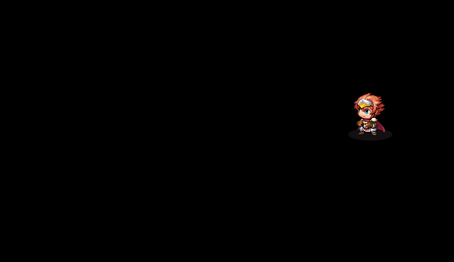

js文件夹下rpg_sprites.js为游戏精灵对象文件，是各种图像实例精灵的对象。RPGMaker的图像处理是采用PIXI.js处理的。所以很多api可以参考PIXI.js的方法。其对PIXI.js进行二次封装，原型为Sprite，可参考RPGMaker汉化js库手册方法： http://ydq-egoist.com/API/RMMV/index.html

### <a href="#p1"> Sprite_Base 类</a> ###


### <a href="#p2"> Sprite_Button 类</a> ###

### <a href="#p3"> Sprite_Character 类</a> ###

### <a href="#p4"> Sprite_Battler 类</a> ###

### <a href="#p5">  Sprite_Actor 类</a> ###

### <a href="#p6">Sprite_Enemy 类</a> ###

### <a href="#p7">Sprite_Animation 类</a> ###

### <a href="#p8">Sprite_Damage 类</a> ###

### <a href="#p9">Sprite_StateIcon 类</a> ###

### <a href="#p10">Sprite_StateOverlay 类</a> ###

### <a href="#p11">Sprite_Weapon类</a> ###

### <a href="#p12">Sprite_Balloon类</a> ###

### <a href="#p13"> Sprite_Picture类</a> ###

### <a href="#p14"> Sprite_Timer类</a> ###

### <a href="#p15">  Sprite_Destination类</a> ###

### <a href="#p16">  Spriteset_Base类</a> ###

### <a href="#p17">  Spriteset_Map类</a> ###

### <a href="#p18">  Spriteset_Battle类</a> ###

 
***
<p id="p1"></p>

## Sprite_Base 

Sprite_Base 是精灵基础类。继承于Sprite类。

**update()** : 每帧更新方法

**hide()** : 隐藏精灵

**show()** : 显示精灵

**updateVisibility()** : 更新隐藏显示状态

**updateAnimationSprites()** : 更新动画显示精灵

**startAnimation(animation, mirror, delay)** ： 开始播放动画

[animation]

[mirror]

[delay]

**isAnimationPlaying()** : 是否有动画在播放。

Sprite_Base 若要添加显示，需要添加到场景子元素才可显示，注意Sprite中添加bitmap图像才能够显示图片：

```js
function Scene_MySelf() {
    this.initialize.apply(this, arguments);
}

Scene_MySelf.prototype = Object.create(Scene_Base.prototype);
Scene_MySelf.prototype.constructor = Scene_MySelf;

Scene_MySelf.prototype.initialize = function () {
    Scene_Base.prototype.initialize.call(this);
};

Scene_MySelf.prototype.create = function () {
    Scene_Base.prototype.create.call(this);
    let m  = new Sprite_Base()
    m.bitmap = ImageManager.loadSystem('GameOver'); //显示System文件下的GameOver图像
    this.addChild(m); //添加到场景中
}
```

***
<p id="p2"></p>

##  Sprite_Button

Sprite_Button是游戏中按钮精灵的对象类。可以生成一个有点击效果的按钮事件。

**setColdFrame(x, y, width, height)** : 按钮没有点击时候的图片显示区域

[x:Number] : 按钮图片的x起始坐标点

[y:Number] : 按钮图片的y起始坐标点

[width:Number] : 需要从起始点显示的宽度

[height:Number] : 需要从起始点显示的高度

**setHotFrame(x, y, width, height)** : 按钮点击时的图片显示区域

[x:Number] : 按钮图片的x起始坐标点

[y:Number] : 按钮图片的y起始坐标点

[width:Number] : 需要从起始点显示的宽度

[height:Number] : 需要从起始点显示的高度

**setClickHandler(method)** : 设置点击按钮回调事件

[method:Function] : 回调方法

**callClickHandler()** : 执行回调事件

**isActive()** : 是否可用

**isButtonTouched()** : 按钮是否触摸

在`img\system`文件下有一个ButtonSet.png的按钮图片文件，这是用于显示游戏中用到的几个按钮，我们可以在一个单独场景中显示:


```js
Scene_MySelf.prototype.create = function () {
    Scene_Base.prototype.create.call(this);
    m  = new Sprite_Button( )
    m.bitmap =  ImageManager.loadSystem('ButtonSet');
    m.setColdFrame(0, 0, 48,48);//设置没有点击的时候区域
    m.setHotFrame(48, 48, 48,48);//设置点击时的区域
    this.addChild(m);
}
```

上面在设置区域的时候都是48是由于ButtonSet图像含有10个小图，前4个按钮长宽均为48px最后一个96px。

***

<p id="p3"></p>

## Sprite_Character

Sprite_Character是游戏中显示角色人物或者事件类型已经地图的单位格子图像

**initMembers()** : 初始化成员数据

**setCharacter(character)** : 为其设置对应角色对象

[character:Game_Character]

**isTile()** : 是否是地图块

**tilesetBitmap(tileId)** : 返回对应id的地图块所需要的图块资源

**setTileBitmap(tileId)** : 设置图像的地图块

**setCharacterBitmap()** : 根据setCharacter设置的角色对象来加载图像

**setupAnimation()** : 播放动画

**isImageChanged()** : 图片源以及索引是否改变

**updateFrame()** : 更新帧方法

**updateTileFrame()** : 更新地图块

**updateCharacterFrame()** : 更新图像帧

**characterBlockX()** : 返回角色所在图片的X格子值

**characterBlockY()** : 返回角色所在图片的Y格子值

**createHalfBodySprites()** : 创建角色身体上下半图，有些地形需要将下半身透明，就是在这里实现的

**updatePosition()** : 更新角色位置

***

<p id="p4"></p>

## Sprite_Battler

Sprite_Battler是战斗界面中的角色和敌人对象精灵。是Sprite_Actor 和 Sprite_Enemy的父类。

**setBattler(battler)** : 设置渲染对象

[battler:Game_Battler] : 设置的渲染对象

**setHome(x,y)** : 设置位置

**setupDamagePopup()** : 初始化伤害弹出

**startMove(x, y, duration)** : 角色移动，注意不同对象调用方式不同，角色对象此移动为相对自己原有位置移动，敌人对象则是移动到对应点

[x:Number] : 相对于自己的位置x偏移量

[y:Number] : 相对于自己的位置y偏移量

[duration:Number] : 移动到达时间，值越大到达目的地的时间越长

Sprite_Battler单独使用不能显示图像，需要使用它的子类实现。

***
<p id="p5"></p>

## Sprite_Actor

Sprite_Actor是用于展示战斗场景中的角色图。

**createMainSprite()** :创建角色主体精灵图像

**createShadowSprite()** : 创建角色阴影图像精灵

**createWeaponSprite()** : 创建角色使用武器图像精灵

**createStateSprite()** :创建状态图像精灵

**setBattler(battler)** : 设置渲染对象，同Sprite_Battler

**moveToStartPosition()** : 定位到开始位置300,0

**setActorHome(index)** : 根据index设置角色图片位置

[index:Number] : index为角色动画索引号

**setupMotion()** : 动作动画初始化

**setupWeaponAnimation()** : 武器动画初始化

下面我们来实现战斗界面中的人物显示：

```js
Scene_MySelf.prototype.create = function(){
    sp = new Sprite_Actor($gameActors.actor(1));//全局变量方便下面调试
    this.addChild(sp);
}
```

`$gameActors.actor(1)` 是需要指定渲染的角色列表的第一个人物。接下来运行`Scene_MySelf`场景。可见入下:



但是他并没有动。你可以在控制台输入以下命令行让他动起来:

```js
sp.startMotion('walk')
sp.startMotion('skill')
```

你会发现角色执行对应动作。更多角色动作可以参考脚本`Sprite_Actor.MOTIONS`的配置项:

```js
Sprite_Actor.MOTIONS = {
    walk:     { index: 0,  loop: true  },
    wait:     { index: 1,  loop: true  },
    chant:    { index: 2,  loop: true  },
    guard:    { index: 3,  loop: true  },
    damage:   { index: 4,  loop: false },
    evade:    { index: 5,  loop: false },
    thrust:   { index: 6,  loop: false },
    swing:    { index: 7,  loop: false },
    missile:  { index: 8,  loop: false },
    skill:    { index: 9,  loop: false },
    spell:    { index: 10, loop: false },
    item:     { index: 11, loop: false },
    escape:   { index: 12, loop: true  },
    victory:  { index: 13, loop: true  },
    dying:    { index: 14, loop: true  },
    abnormal: { index: 15, loop: true  },
    sleep:    { index: 16, loop: true  },
    dead:     { index: 17, loop: true  }
};
```

如上`walk`,`missile`,`victory` 等属性都可以作为字符串变量传入`startMotion`方法中执行对应的动画。你也可以执行`startMove(-500,200,20)` 让人物移动然后又返回原来位置，可以通过这个来接近其他角色。

也可以指定武器id然后执行武器动画攻击:`sp._battler._weaponImageId = 1`


**
<p id="p6"></p>

## Sprite_Enemy

Sprite_Enemy是战斗场景中敌人的图片精灵对象。

**createStateIconSprite()** : 创建状态图标

**setBattler(battler)** : 创建渲染对象，同Sprite_Battler

**loadBitmap(name, hue)** :  加载敌人对象图

[name:String] : 文件名称不含尾缀名

[hue:Number] : 色彩值

**startEffect(effectType)** : 展现动画效果

[effectType:String] 动画效果标志字符串,参考startEffect方法中出现的字符串


与角色对象构造函数不同，敌人需要指定数据库中敌人列表id和位置，如下:


```js
Scene_MySelf.prototype.create = function(){
    sp = new Sprite_Enemy(new Game_Enemy(1,200,200));
    this.addChild(sp);
    sp.x = 200;
    sp.y = 200;
}
```

原脚本敌人是没有像角色那样的动画各种动画显示，不过由于他们两个都是同样继承Sprite_Battler类。我们只需要对原方法稍微修改即可实现让敌人也能有动画效果。想不想让游戏角色列表中的人物成为战斗中的敌人？还可以实现和主角们一样的攻击动画。可以参考插件里面的角色敌人插件。哪里可以告诉你怎么制作。


***
<p id="p7"></p>

## Sprite_Animation

Sprite_Animation 是游戏中动画渲染的精灵类，此动画为游戏数据库中渲染动画。
继承Sprite类。

**setup(target, animation, mirror, delay)** : 初始化数据

[target:Sprite] : 触发的精灵对象，即指定动画释放的对象上

[animation:Object] : 动画编辑对象，$dataAnimations中的元素

[mirror:Boolean] : 镜像反转渲染？

[delay:Number] : 延时触发，单位帧数

**setupDuration()** : 初始化计数器，可重新播放动画

**absoluteX()** : 返回动画精灵的绝对x偏移

**absoluteY()** : 返回动画精灵的绝对y偏移

**isPlaying()** : 是否在播放中

**loadBitmaps()** : 加载纹理

在游戏平台中若要显示数据库中的动画只需要指定即可如下:

```js
Scene_MySelf.prototype.create = function(){
    ac = new Sprite_Enemy(new Game_Enemy(1,200,200))
    sp = new Sprite_Animation();
    sp.setup(ac,$dataAnimations[1],1,96)
    this.addChild(sp);
    this.addChild(ac);
    sp.x = 200;
    sp.y = 200;
}
```

可调用`sp.setupDuration()`再次播放动画，`sp.startHiding()`可以隐藏其指定的对象上，即setup第一个参数的元素


***

<p id="p8"></p>

## Sprite_Damage

Sprite_Damage是战斗场景中弹出的伤害值精灵显示图像

**setup(target)** : 初始化启动

**digitWidth()** : 返回单位数字的宽度

**igitHeight()** : 返回单位数字的高度

**createMiss()** : 创建攻击时MISS提示的图像

**createDigits(baseRow, value)** : 创建数字图像

[baseRow:Number] : 基础行

[value:Number] : 数值

该精灵对象需要指定触发对象才能触发，如下对敌人对象添加一个伤害弹出:

```js
Scene_MySelf.prototype.create = function(){
    let enemy = new Game_Enemy(1,200,200);
    ac = new Sprite_Enemy(enemy)
    sp = new Sprite_Damage();
    sp.setup(enemy)
    this.addChild(sp);
    this.addChild(ac);
    ac.x = 400;
    ac.y = 300;
}
```


当然敌人没有扣血不会弹出伤害，我们需要在控制台输入
`ac._battler.gainHp(-25)` 敌人对象扣25血

`ac._battler.startDamagePopup()` 弹出伤害


 
***
<p id="p9"></p>

## Sprite_StateIcon

Sprite_StateIcon是用于展示角色状态的图标对象。该图像会自动切换所有状态显示，而不是显示同时状态

**loadBitmap()** : 加载对应的图标文件

**setup(battler)**  : 设置显示人物状态图标的对象

[battler:Game_Battler] : 游戏战斗角色对象

```js
Scene_MySelf.prototype.create = function(){
    let enemy = new Game_Enemy(1,200,200);
    ac = new Sprite_Enemy(enemy)
    sp = new Sprite_StateIcon();
    sp.setup(enemy)  //指定显示图像
    this.addChild(sp);
    this.addChild(ac);
    ac.x = 400;
    ac.y = 300;
    sp.x = 200;
    sp.y = 200;
}
```

运行后在控制台调用`ac._battler.addBuff(4)` 可以显示出状态图标。注意调用后你会看到有两个图标。这是由于敌人对象精灵本身就有一个状态显示图像。多出的这个`Sprite_StateIcon`是自定义显示位置的,可以显示在敌人对象之上的其他位置。

***
<p id="p10"></p>

## Sprite_StateOverlay

Sprite_StateOverlay是用于显示主角在战斗界面中被施加了异常状态的图像精灵。同上Sprite_StateIcon类一样只不过是作用于主角


```js
Scene_MySelf.prototype.create = function(){

    ac = new Sprite_Actor($gameActors.actor(1))
    sp = new Sprite_StateOverlay();
    sp.setup($gameActors.actor(1))  //指定显示图像
    this.addChild(sp);
    this.addChild(ac);
    ac._battler.addNewState(9)  //显示异常状态
}
```


注意有些状态不一定能有异常状态显示，因为有些动画没有。可以在$dataStates中查看那个状态id的`overlay`属性不为0即可显示异常动画


***
<p id="p11"></p>

## Sprite_Weapon

Sprite_Weapon是战斗场景中显示武器攻击的动画精灵

**setup(weaponImageId)** : 初始化并显示攻击动画

[weaponImageId:Number] 武器动画id索引，可参考`system/Weaponsx.png`的武器索然位置
必须大于1才有显示图像。如下:

```js
Scene_MySelf.prototype.create = function(){
    ac = new Sprite_Actor($gameActors.actor(1))
    sp = new Sprite_Weapon();
    sp.setup(2)  //指定显示图像
    sp.x = ac.x - 16;
    sp.y = ac.y + 16;
    this.addChild(sp);
    this.addChild(ac);
}
```


***
<p id="p12"></p>

## Sprite_Balloon

Sprite_Balloon 是用于显示人物头上的心情气泡精灵对象。可参考`img/system/`文件目录下的`Balloon.png` 每一排代表一个气泡。

**setup(balloonId)** :根据行数id来设置并显示。

[balloonId:Number] : 行数id

如下可以在人物头上显示气泡：

```js
Scene_MySelf.prototype.create = function(){
    ac = new Sprite_Actor($gameActors.actor(1))
    sp = new Sprite_Balloon();
    sp.setup(2)  //指定显示图像
    sp.x = ac.x;
    sp.y = ac.y - 64;
    this.addChild(sp);
    this.addChild(ac);
}
```


***
<p id="p13"></p>

## Sprite_Picture

Sprite_Picture是用于在屏幕上显示图片的精灵对象。

**picture()** : 返回该图片的数据对象，注意是图片的配置数据即Game_Picture对象。


**loadBitmap()** : 加载图片位图，修改此方法可以指定屏幕上图片的文件夹来源，
默认为`img/pictures`下的文件图片，如果需要手动调出图片需要有Game_Picture对象
如下:

```js

Scene_MySelf.prototype.create = function(){
    //在屏幕对象中添加一个图片对象，参数内容可以参考对象文档的Game_Picture中的show方法和Game_Screen对象中的showPicture方法
    $gameScreen.showPicture(1,'lumnca',0,0,0,100,100,255,1)
    //图片精灵的构造参数需要提供图片id，即为上行代码的第一个参数。
    sp = new Sprite_Picture(1);
    this.addChild(sp);
}
```

运行后打开场景即可看到图片


